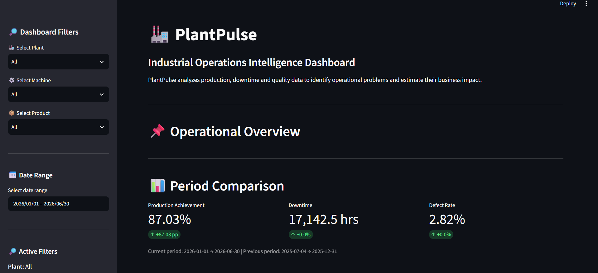

# PlantPulse — Operational Intelligence & Decision Support Dashboard

## 📌 Project Overview

**PlantPulse** is an interactive operations analytics and decision-support dashboard designed to help manufacturing plants identify production losses, quality problems, equipment downtime, and high-risk machines.

## Dashboard Preview

 

The system combines **SQL-based data analysis, Python/Pandas processing, and a Streamlit dashboard** to convert raw plant data into actionable operational insights.

Instead of simply displaying historical data, PlantPulse connects operational metrics to:

* Production performance
* Quality performance
* Equipment downtime
* Operational risk
* Priority machines
* Recommended actions
* Estimated financial impact

---

## 🎯 Business Problem

Manufacturing plants generate large amounts of operational data across production, quality, and maintenance/downtime systems.

However, raw data alone does not immediately answer important management questions such as:

* Which machines are underperforming?
* Which machines have excessive downtime?
* Where are quality losses occurring?
* Which machines require immediate investigation?
* What is the potential financial impact of these losses?
* Should management prioritize production, quality, or downtime-related problems?

PlantPulse addresses these questions through a centralized interactive dashboard.

---

## 🏗️ System Architecture

```text
                    Manufacturing Data
                           │
          ┌────────────────┼────────────────┐
          │                │                │
          ▼                ▼                ▼
      Production         Quality         Downtime
       Dataset           Dataset          Dataset
          │                │                │
          └────────────────┼────────────────┘
                           ▼
                     SQLite Database
                           │
                           ▼
                    SQL Analysis Layer
                           │
                           ▼
                   Python / Pandas Layer
                           │
                           ▼
                    Streamlit Dashboard
                           │
          ┌────────────────┼─────────────────┐
          ▼                ▼                 ▼
      Performance        Risk &          Financial
       Analysis       Prioritization       Impact
          │                │                 │
          └────────────────┼─────────────────┘
                           ▼
                 Management Recommendations
```

---

## 📊 Core Data Tables

PlantPulse works with three primary operational datasets.

### 1. Production

Contains production target and actual output information.

Key fields include:

* `Date`
* `Plant`
* `Machine`
* `Target_Production`
* `Actual_Production`

### 2. Quality

Contains production quantity and defective-unit information.

Key fields include:

* `Date`
* `Plant`
* `Machine`
* `Units_Produced`
* `Defective_Units`

### 3. Downtime

Contains machine downtime information.

Key fields include:

* `Date`
* `Plant`
* `Machine`
* `Downtime_Hours`

These datasets are connected using common dimensions such as **Plant, Machine, and Date**.

---

# 🔎 Dashboard Features

## 1. Interactive Filters

The dashboard provides filters for:

* Plant
* Machine
* Date Range

The filters can be combined to investigate the operation at different levels.

Examples:

```text
All Plants + All Machines
Plant A + All Machines
All Plants + Machine M01
Plant A + Machine M01
```

This allows users to move from a high-level plant overview to a specific machine investigation.

---

# 🏭 Production Performance

PlantPulse compares:

```text
Target Production
        vs
Actual Production
```

### Production Achievement

Production achievement is calculated as:

```text
Production Achievement (%)
=
Actual Production / Target Production × 100
```

### Production Shortfall

```text
Production Shortfall (%)
=
100 − Production Achievement
```

The dashboard presents production performance at the plant and machine level.

---

# 🔍 Quality Performance

The quality module analyzes defective production.

### Defect Rate

```text
Defect Rate (%)
=
Defective Units / Units Produced × 100
```

The dashboard allows users to identify machines with comparatively high defect rates and investigate potential process or quality-control problems.

---

# ⏱️ Downtime Analysis

The downtime module measures total machine downtime over the selected period.

```text
Total Downtime
=
Σ Downtime Hours
```

Machines are ranked based on downtime to highlight equipment that may require maintenance or operational investigation.

---

# 📉 Downtime vs Production Performance

PlantPulse also examines the relationship between downtime and production achievement.

The dashboard calculates the correlation between:

```text
Downtime Hours
        and
Production Achievement
```

A negative correlation indicates that higher downtime tends to be associated with lower production achievement.

The visualization uses a line connecting plant-level observations, with the Y-axis dynamically zoomed around the actual achievement values to make the trend easier to interpret.

---

# ⚠️ Operational Risk Score

PlantPulse combines production, quality, and downtime indicators into an **Operational Risk Score**.

The current scoring approach incorporates:

* Production shortfall
* Downtime
* Defect rate

Conceptually:

```text
Operational Risk
=
Production Loss
+
Downtime Impact
+
Quality Impact
```

Higher scores indicate greater operational concern.

The dashboard then categorizes machines into different risk levels so that management can focus attention on the most important operational issues.

---

# 🎯 Priority Machines

PlantPulse ranks machines according to their operational risk.

The priority analysis considers:

* Operational Risk Score
* Production Shortfall
* Defect Rate
* Downtime Hours

The system also determines a **Primary Action** for each machine.

Possible actions include:

```text
Investigate downtime
Investigate quality
Investigate production
```

This converts numerical analysis into a more practical investigation priority.

---

# 🧠 Management Recommendations

Based on the highest-priority machine, PlantPulse automatically generates a management recommendation.

For example:

```text
Prioritize downtime investigation on Plant A - M05.

The machine recorded elevated downtime and has a high
operational risk score. Review recurring stoppages,
maintenance history, and machine availability.
```

The recommendation changes automatically according to the selected filters and calculated risk indicators.

---

# 💰 Business Impact Analysis

PlantPulse estimates the potential financial impact associated with operational losses.

Users can modify three business assumptions from the dashboard:

### Downtime Cost

```text
Downtime Cost
=
Downtime Hours × Cost per Downtime Hour
```

### Defect Cost

```text
Defect Cost
=
Defective Units × Cost per Defective Unit
```

### Missed Production Value

```text
Missed Production Value
=
Production Shortfall × Value per Missed Unit
```

### Total Estimated Impact

```text
Total Estimated Impact
=
Downtime Cost
+
Defect Cost
+
Missed Production Value
```

These values are intended as **scenario-based estimates**, allowing users to understand the potential financial significance of operational losses.

---

# 🛠️ Technology Stack

### Programming & Analytics

* Python
* Pandas
* NumPy

### Database

* SQLite
* SQL

### Dashboard

* Streamlit
* Altair

### Development

* VS Code
* Python Virtual Environment

---

# 📁 Project Structure

```text
plantpulse/
│
├── dashboard/
│   └── app.py
│
├── sql/
│   └── run_queries.py
│
├── data/
│
├── database/
│
├── .venv/
│
└── README.md
```

> The exact database/data filenames may vary depending on the local project setup.

---

# ▶️ How to Run

## 1. Clone or download the project

Open the project folder in VS Code.

## 2. Create/activate the virtual environment

Windows:

```bash
.venv\Scripts\activate
```

## 3. Install required packages

```bash
pip install pandas numpy streamlit altair
```

If the project contains a `requirements.txt` file:

```bash
pip install -r requirements.txt
```

## 4. Start the dashboard

From the project root:

```bash
streamlit run dashboard/app.py
```

The Streamlit application will open in the browser.

---

# 🔄 Dashboard Workflow

The overall decision-making workflow is:

```text
Raw Operational Data
        ↓
Data Filtering
        ↓
Production Analysis
        ↓
Quality Analysis
        ↓
Downtime Analysis
        ↓
Operational Risk Calculation
        ↓
Priority Machine Identification
        ↓
Primary Action
        ↓
Financial Impact Estimation
        ↓
Management Recommendation
```

---

# 💡 Key Business Value

PlantPulse helps transform operational data into actionable decisions.

Instead of asking:

> "What happened?"

the dashboard helps answer:

> "Where is the problem?"

> "How severe is it?"

> "What should we investigate first?"

> "What could be the financial impact?"

This makes PlantPulse a **decision-support system rather than a purely descriptive dashboard**.

---

# 🚀 Future Improvements

Potential future enhancements include:

* Predictive maintenance using machine downtime history
* Machine-level anomaly detection
* Automated maintenance alerts
* Production forecasting
* Quality defect prediction
* Time-series risk trends
* Root-cause analysis
* Integration with live plant databases
* Automated email/notification alerts
* Role-based dashboards for operators, engineers, and management
* Machine health scoring using additional sensor data
* Historical benchmarking between plants
* Automated PDF management reports

---

# 📌 Project Outcome

PlantPulse demonstrates the integration of:

**SQL + Python + Pandas + Data Analytics + Streamlit + Business Intelligence**

to create an interactive manufacturing operations analytics platform.

The project focuses not only on visualizing operational data, but also on **prioritizing problems, estimating business impact, and recommending management actions**.
